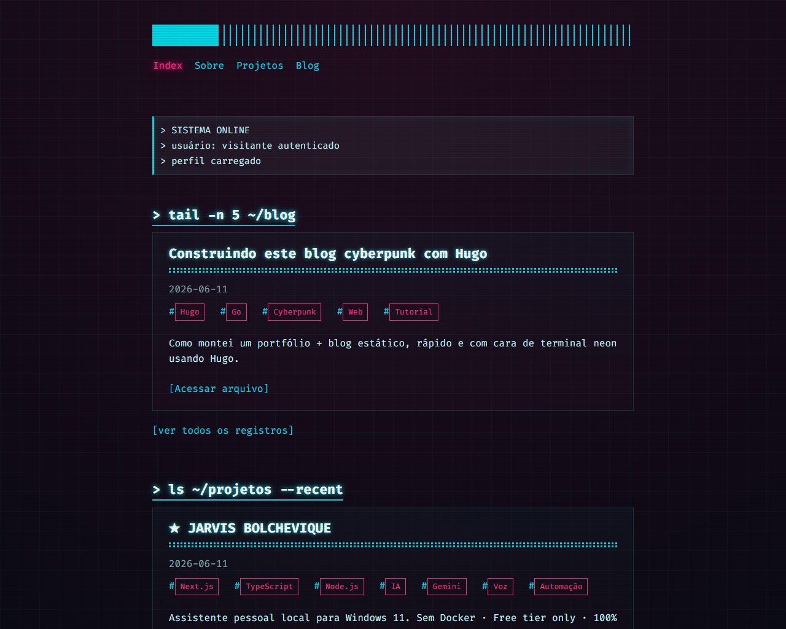

# Creep.tech — Portfólio + Blog

> Portfólio e blog pessoal do Patrick, com estética **cyberpunk** e uma pegada de terminal do Linux.
> Site estático gerado com [Hugo](https://gohugo.io) e publicado automaticamente no GitHub Pages.
> ClaudeCode foi utilizado para pesquisa e aperfeiçoamento do projeto. 

### 🔗 No ar: https://patrickcavalcantte.github.io/creeptech/



---

## ⚡ Stack

| Camada     | Tecnologia                                              |
|------------|---------------------------------------------------------|
| Gerador    | [Hugo Extended](https://gohugo.io) `v0.163.0`           |
| Tema base  | [terminal](https://github.com/panr/hugo-theme-terminal) (panr) |
| Estilo     | Camada CSS cyberpunk própria (neon, scanlines, glitch)  |
| Templates  | Go `html/template`                                      |
| Deploy     | GitHub Actions → GitHub Pages                            |

---

## 🚀 Rodando localmente

Pré-requisito: [Hugo **Extended**](https://gohugo.io/installation/) 0.123+ instalado.

```bash
# clone o repositório
git clone https://github.com/patrickcavalcantte/creeptech.git
cd creeptech

# sobe o servidor de desenvolvimento (com live-reload)
hugo server --buildDrafts
```

Acesse **http://localhost:1313/**. Qualquer alteração em conteúdo, layout ou
CSS recarrega o navegador automaticamente.

> O tema já está incluído no repositório (não usa submódulo), então não é
> preciso nenhum passo extra após o clone.

---

## 📁 Estrutura

```
.
├── content/
│   ├── _index.md          # hero da home
│   ├── about.md           # página "Sobre"
│   ├── posts/             # registros do blog
│   └── projects/          # projetos do portfólio
├── layouts/
│   ├── index.html         # home customizada (últimos posts/projetos)
│   ├── partials/          # menu (item ativo), card da home, head estendido
│   └── shortcodes/        # avatar (caminho ciente da baseURL)
├── assets/css-custom/
│   └── neon.css           # ★ camada de estilo cyberpunk
├── static/img/            # imagens (avatar etc.)
├── themes/terminal/       # tema base
├── hugo.toml              # configuração do site
└── .github/workflows/
    └── hugo.yml           # pipeline de deploy
```

---

## ✍️ Adicionando conteúdo

**Novo post de blog:**

```bash
hugo new content posts/meu-novo-post.md
```

**Novo projeto:**

```bash
hugo new content projects/meu-projeto.md
```

Edite o front matter (`title`, `date`, `description`, `tags`) e escreva em
Markdown. A home lista automaticamente os **5 mais recentes** de cada seção,
do mais novo para o mais antigo — não é preciso mexer em nenhum layout.

---

## 🎨 Identidade visual

Toda a estética cyberpunk vive em [`assets/css-custom/neon.css`](assets/css-custom/neon.css),
carregada **por último** (via `layouts/partials/extended_head.html`, com
fingerprint) para sobrescrever o tema sem editá-lo. Lá ficam a paleta neon,
o grid de fundo, as scanlines, o glow dos títulos, o glitch no hover e o
destaque do item de menu ativo.

Paleta:

| Token          | Cor        |
|----------------|------------|
| `--background` | `#0b0a14`  |
| `--foreground` | `#c8f7ff`  |
| `--accent`     | `#05d9e8` (ciano neon) |
| `--accent-alt` | `#ff2e88` (magenta neon) |

---

## 🛰️ Deploy

O deploy é **automático**. A cada `push` na branch `main`, o GitHub Actions
([`.github/workflows/hugo.yml`](.github/workflows/hugo.yml)) constrói o site
com o Hugo e publica no GitHub Pages.

```bash
git add -A
git commit -m "novo post"
git push
```

Em ~1–2 minutos o site no ar é atualizado. O progresso aparece na aba
**Actions** do repositório.

---

## 📟 Sobre

Feito por **Patrick** — designer de produtos digitais e entusiasta de código.

- Instagram: [@creep__tech](https://instagram.com/creep__tech)
- GitHub: [@patrickcavalcantte](https://github.com/patrickcavalcantte)

>Defensor de tecnologia soberana, código divertido e estética cyberpunk. `> logout`
